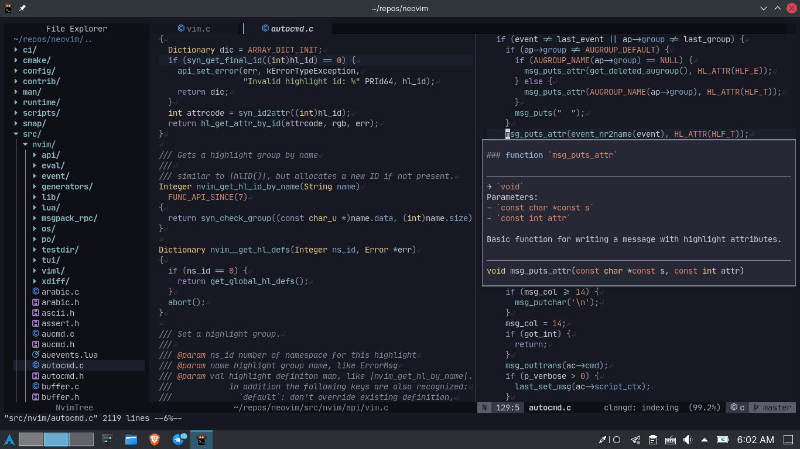

# icy.nvim

---

My own variation of [iceberg](https://github.com/cocopon/iceberg.vim) made with [lush.nvim](https://github.com/rktjmp/lush.nvim).

This is intended for my own personal usage and I don't plan to please everyone :p

Feel free to use it though. You can also check out my [other colourscheme](https://github.com/elianiva/gruvy.nvim)

